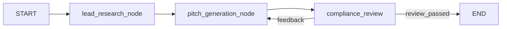

# B2B 智能获客自动化系统

LangGraph MVP that automates B2B outbound prospecting: mock lead research → AI pitch generation → compliance review with a feedback loop.

**Live repo:** [github.com/ryanisnew/B2B-Sales-Agent](https://github.com/ryanisnew/B2B-Sales-Agent)

## Highlights (for recruiters)

- **Agentic workflow** built with [LangGraph](https://github.com/langchain-ai/langgraph): stateful graph, conditional routing, critic loop.
- **Cost-optimized LLM** via [OpenRouter](https://openrouter.ai/) using `deepseek/deepseek-v4-flash` (OpenAI-compatible API).
- **Reasoning enabled** through OpenRouter’s `extra_body` for stronger generation and review quality.
- **B2B domain logic**: personalized outreach for 百恩 (BAIEN), mock automotive lead (e.g. Valeo), Chinese compliance critic.

## Architecture



| Node | Role |
|------|------|
| `lead_research_node` | Mock: select target company (e.g. Valeo) and build contact profile |
| `pitch_generation_node` | LLM writes JSON pitch (`subject`, `body`, `call_to_action`) |
| `合规审核_node` | LLM critic returns Yes/No + feedback; failed reviews loop back |

### Shared state

| Field | Type | Description |
|-------|------|-------------|
| `company_list` | `list` | Candidate accounts |
| `current_company` | `str` | Active target |
| `lead_info` | `dict` | Contact + pain points |
| `generated_pitch` | `dict` | Outreach email JSON |
| `review_passed` | `bool` | Compliance gate |
| `corrections_feedback` | `str` | Critic feedback for retries |

## Tech stack

- Python 3.10+
- [LangGraph](https://github.com/langchain-ai/langgraph) — workflow orchestration
- [LangChain OpenAI](https://python.langchain.com/docs/integrations/chat/openai/) — `ChatOpenAI` pointed at OpenRouter
- [OpenRouter](https://openrouter.ai/) — `deepseek/deepseek-v4-flash`

## Quick start

### 1. Clone and install

```bash
git clone https://github.com/ryanisnew/B2B-Sales-Agent.git
cd B2B-Sales-Agent
python -m venv .venv

# Windows
.venv\Scripts\activate

# macOS / Linux
# source .venv/bin/activate

pip install -r requirements.txt
```

### 2. Configure API key

```bash
# Windows
copy .env.example .env

# macOS / Linux
# cp .env.example .env
```

Edit `.env` and set your key from [OpenRouter Keys](https://openrouter.ai/keys):

```env
OPENROUTER_API_KEY=sk-or-v1-...
```

Never commit `.env` — it is listed in `.gitignore`.

### 3. Run

```bash
python main.py
```

Example output sections: lead info → generated pitch JSON → compliance pass/fail.

## Project layout

```
B2B-Sales-Agent/
├── main.py           # LangGraph app + entry point
├── requirements.txt
├── .env.example      # Template (safe to commit)
├── .env              # Your secrets (local only, gitignored)
└── README.md
```

## Roadmap

- [ ] Replace mock `lead_research_node` with real CRM / web research APIs
- [ ] Add max retry cap on compliance loop
- [ ] Structured outputs (`with_structured_output`) for pitch and review JSON
- [ ] Export approved pitches to email / CRM
- [ ] Observability (LangSmith or OpenRouter usage dashboard)

## Security

- Rotate any API key that was ever committed or shared publicly.
- Use `.env` locally only; keep `.env.example` as placeholders.

## License

MIT — see [LICENSE](LICENSE).
